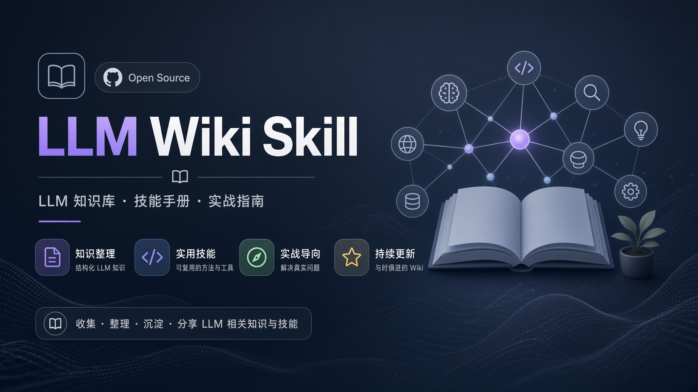

<!-- markdownlint-disable MD033 MD041 -->

<p align="center">
  
</p>

<p align="center">
  <strong>让知识留下来，而不只是让答案出现。</strong><br>
  本地 Markdown · Git 版本管理 · 双层防腐化 · 可选 Agent Skill
</p>

<p align="center">
  <a href="#开始使用">开始使用</a> &nbsp; / &nbsp;
  <a href="#双层闸门">双层闸门</a> &nbsp; / &nbsp;
  <a href="#换一台设备">换一台设备</a> &nbsp; / &nbsp;
  <a href="#english">English</a>
</p>

## 从一份资料，到一张知识网络

你收集文章、论文和代码。维护者把它们整理成**有来源、有交叉引用、可以持续更新**的 wiki，而不是只留下一段聊天记录。

基于 [Karpathy 的 LLM Wiki 模式](https://gist.github.com/karpathy/442a6bf555914893e9891c11519de94f)，本项目提供维护协议、命令行工具与模板。**不绑定某个 Agent，不自带模型，也不要求安装 Skill。** 你可以用自己的本地文件助手，也可以人工维护。

| 留下知识 | 保持可追溯 | 发现变化 |
| :--- | :--- | :--- |
| 把有价值的综合结果写成页面，下次继续积累。 | 原文与整理后的页面分层，代码仓记录引用版本。 | 跟踪代码变化，生成待检工单，再复核相关知识。 |

**装的是维护工具，拥有的是你自己的知识库。** 工具开源，wiki 独立存放，可以同步到私有 GitHub 仓库。

## 开始使用

需要 **Python 3.9+ 与 Git**，无需 pip 包。先初始化空知识库，不要求配置模型或 Git 身份。

### 01 / 下载与初始化

```bash
git clone https://github.com/feeeeling/llm-wiki-skill.git
python3 llm-wiki-skill/scripts/wiki.py init my-wiki
cd my-wiki
python3 scripts/wiki.py doctor
```

`init` 不覆盖已有目录，不自动提交或推送。Windows 可用 `python` 或 `py -3` 代替 `python3`。

### 02 / 接入你习惯的工具

| 你的工具 | 怎么使用 |
| :--- | :--- |
| **能读写本地文件的 Agent / IDE 助手** | 打开 `my-wiki`，明确让它先读 `AGENTS.md` 和 `wiki/index.md`。 |
| **支持 Agent Skills 的宿主** | 可选：按宿主文档安装本仓库的 [SKILL.md](SKILL.md)。安装目录和自动发现机制由宿主决定。 |
| **普通聊天窗口** | 粘贴协议与资料，审核回答后自己保存为 Markdown；它不能替你执行本地脚本。 |
| **Markdown 编辑器** | 直接浏览与人工维护。Obsidian 可选，不是运行依赖。 |

通用的第一条请求：

> 先阅读 AGENTS.md 和 wiki/index.md。把这份资料加入知识库，保留来源，关联已有页面，列出改动，未经确认不要推送。

不需要 `/wiki-lint` 等特殊命令。不会自动读取 `AGENTS.md` 的工具，要由用户显式提供协议。

### 03 / 阅读与同步

Obsidian → **Open folder as vault** → 选择 `my-wiki` → 打开 `wiki/overview.md`。
也可以使用其他 Markdown 编辑器。创建 GitHub 空仓库、配置 Git 身份后，按照生成的
`my-wiki/README.md` 选择文件、提交、添加 remote 并推送。

这是一套 **Git 工作流，不是后台自动同步服务**。本地-only 使用不需要 GitHub。

## 双层闸门

**源文件变了，不代表结论一定错了；但它值得被重新检查。**

脚本负责发现变化，维护者负责理解变化。硬闸门不等待模型，软闸门负责复核证据。

<p align="center">
  
</p>

| 层次 | 负责什么 | 不负责什么 |
| :--- | :--- | :--- |
| **硬闸门 · CLI** | 对比已整理版本与本地代码，按跟踪路径生成工单。 | 不判断真假、不调用模型、不自动推进已整理版本。 |
| **软闸门 · 协议** | 按 `AGENTS.md` 复核相关来源与页面，处理语义过时。 | 不是运行时强制拦截器，依赖维护者遵守协议。 |

```bash
python3 scripts/wiki.py check --all   # 检测已登记的本地代码源
python3 scripts/wiki.py status        # 只列已有待检工单
```

没有绑定的源、缺失的提交或未建立的初次基线会报告问题，而不是宣称“知识最新”。
只登记普通文章时，无需接代码仓或装 Hook。

<details>
<summary><strong>可选：接入一个代码仓</strong></summary>

```bash
python3 scripts/wiki.py register my-project --repo /path/to/code \
  --track src/ --track README.md --page wiki/concepts/my-project.md
```

- `sources/my-project.json`：URL、跟踪范围、页面和版本基线，可同步。
- `.llm-wiki.local.json`：这台机器的代码路径，自动忽略，不同步。

第一次整理后，在 JSON 中填入实际核对的 `compiled_rev`。在此之前，检测提示需要
初次 ingest。CLI 不会伪造“已经读过”的事实。

```bash
python3 scripts/wiki.py check --source my-project
python3 scripts/wiki.py hooks --source my-project  # 可选，需要 POSIX shell
```

安装器识别目标代码仓的 hooks 路径（含 `core.hooksPath`），遇到已有冲突 Hook 会
拒绝覆盖，要求人工接线。每台设备单独安装；reset、单纯 fetch 等操作不一定触发
Hook，使用前仍可手动检测。

详情：[接入指南](references/onboarding.md) · [Hook 说明](references/hooks.md) · [来源模板](templates/source.json)

</details>

## 换一台设备

```bash
git clone https://github.com/YOU/YOUR_WIKI.git
cd YOUR_WIKI
python3 scripts/wiki.py doctor

# 有代码源时，重新绑定本机路径
python3 scripts/wiki.py bind my-project --repo /this/device/code
```

知识库自带 CLI，不依赖原设备的 skill 安装路径。只有在需要新建 wiki 或安装 Skill
时才需要本项目仓库。Hook 可选，模型接入由你的工具负责。

## 日常工作流

| 任务 | 直接告诉维护者 |
| :--- | :--- |
| **收录** | “把这篇文章加入知识库，关联已有概念。” |
| **提问** | “我们对这个问题已经知道什么？给出来源与版本。” |
| **维护** | “处理相关的 drift 工单，复核来源并更新页面。” |
| **巡检** | “检查孤儿页、失效链接、矛盾和过时结论。” |

完整流程：[维护协议](references/protocol.md)。先检查 Git 状态，避免混入别人的改动；
不要无条件 pull、全量 stage 或覆盖他人的页面。

<details>
<summary><strong>知识库目录与隐私边界</strong></summary>

```text
my-wiki/
├── AGENTS.md             不绑定宿主的维护协议
├── raw/                  原始资料与附件
├── wiki/                 摘要、概念、实体与综合页面
├── sources/              共享的代码仓登记
├── queue/drift/          可同步的待检工单
├── scripts/              Python CLI 与可选 shell 兼容入口
├── .obsidian/            可选阅读配置
└── .llm-wiki.local.json   本机路径绑定（Git 忽略）
```

本地存储 ≠ 本地推理。使用云端模型时，读入内容可能发送给模型服务商。
私有 GitHub 仓库也不是端到端加密备份。不要把密钥或未经许可的数据收进 wiki。

</details>

## 开发与兼容性

```bash
python3 -m unittest discover -s tests -v
```

测试覆盖空目录初始化、跨设备绑定、Hook 安装与冲突保护、工单去重、版本错误、
路径越界与 frontmatter。CI 配置覆盖 macOS、Linux、Windows 的 Python CLI；
实际结果以仓库 Actions 为准，不将未运行的平台视为已验证。

旧版 YAML 来源和 shell 入口有兼容支持，但更新不会自动覆盖你的 wiki。
迁移前请读 [旧版迁移](references/onboarding.md#旧版迁移)。

## English

**Host-independent tools for a local, Git-versioned Markdown wiki.** Python 3.9+
and Git are required; no pip packages, model provider, MCP server or agent host is
required by the CLI. Agent Skills support is optional.

Clone, run `python3 scripts/wiki.py init PATH`, then `doctor`. Use your preferred
file-capable assistant after explicitly loading the wiki's `AGENTS.md`, or maintain
pages manually. Text-only assistants require manual file handling.

The mechanical gate creates drift tickets; a maintainer reviews affected knowledge.
The soft gate is a protocol, not an enforced query blocker. `status` only lists
existing tickets; `check --all` scans locally bound code sources. Nothing pushes
or calls a model automatically. On Windows use `python`/`py -3`; optional hooks need
Git Bash or WSL. See [onboarding](references/onboarding.md).

---

Inspired by [Karpathy · LLM Wiki](https://gist.github.com/karpathy/442a6bf555914893e9891c11519de94f). Optional [Agent Skills](https://agentskills.io) integration. Released under [MIT](LICENSE).
