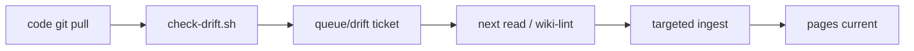

<!-- markdownlint-disable MD033 MD041 -->

<p align="center">
  
</p>

<p align="center">
  <a href="https://gist.github.com/karpathy/442a6bf555914893e9891c11519de94f">Karpathy pattern</a>
  &nbsp;·&nbsp;
  <a href="https://agentskills.io">Agent Skills</a>
  &nbsp;·&nbsp;
  <a href="LICENSE">MIT</a>
  &nbsp;·&nbsp;
  bash + git
</p>

An [Agent Skill](https://agentskills.io) that turns Pi / Claude Code / Codex into a **wiki maintainer**. Knowledge is compiled when you ingest a source — not re-derived from RAG chunks on every question.

Obsidian is the IDE. The agent is the programmer. The wiki is the codebase.

| This repo (public skill) | Your wiki repo (usually private) |
| --- | --- |
| Protocol, scripts, templates | `wiki/` pages, `raw/` sources, drift tickets |
| `git clone` and install | GitHub sync across devices |

---

## Dual gate

Git is never blocked. **Querying a stale wiki is.**



**Hard** — `scripts/check-drift.sh` (hooks, CI, or `--report`). Diffs `compiled_rev` against `HEAD`, intersects `track:` paths, opens a ticket. No LLM.

**Soft** — before answering, or on `/wiki-lint`, the agent reads that diff, patches mapped pages, closes the ticket, advances the SHA.

`.git/hooks` do **not** travel with GitHub. Run [install-hooks](references/hooks.md) once per machine per code repo.

---

## Install

```bash
git clone git@github.com:feeeeling/llm-wiki-skill.git
mkdir -p .agents/skills
ln -s "$(pwd)/llm-wiki-skill" .agents/skills/llm-wiki   # Pi, project-local
```

Then create the wiki repo you actually own:

```bash
bash llm-wiki-skill/scripts/init-wiki.sh ~/my-wiki
cd ~/my-wiki
git remote add origin git@github.com:<you>/<wiki>.git
git push -u origin main
```

Optional — watch a code repo:

```bash
cp templates/source.yaml ~/my-wiki/sources/my-repo.yaml  # edit git / paths / track
bash ~/my-wiki/scripts/install-hooks.sh /path/to/code-repo
```

Claude Code / Codex: clone into that host’s skills directory instead of `.agents/skills`.

---

## Daily

```text
git pull          # code  → post-merge writes a drift ticket
git pull          # wiki  → other devices see it
ask / wiki-lint   # agent updates pages, closes ticket
git push          # wiki
```

```bash
bash ~/my-wiki/scripts/check-drift.sh --report   # no LLM
```

After init:

```text
AGENTS.md         schema (soft gate)
raw/              immutable non-code sources
wiki/             pages the agent owns
sources/*.yaml    pointers to code repos
queue/drift/      tickets — commit these
scripts/          check-drift.sh · install-hooks.sh
```

Protocol: [SKILL.md](SKILL.md) · [references/protocol.md](references/protocol.md)

---

## 中文

把 [Karpathy 的 LLM Wiki](https://gist.github.com/karpathy/442a6bf555914893e9891c11519de94f) 做成可安装 Skill，并加上双闸门：代码 SHA 一动就开工单，下次阅读再编译页面。

- **硬闸门** `check-drift.sh`：只开 `queue/drift/`，不跑模型、不改正文
- **软闸门**：下次提问或 `/wiki-lint` 时消化工单
- **不拦截 git**，拦截的是拿过期页当事实
- Hook 在 `.git/hooks`，每台电脑要跑一次 `install-hooks.sh`
