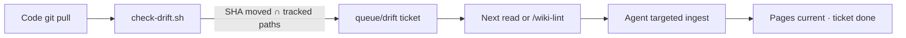

<!-- markdownlint-disable MD033 MD036 MD041 -->
<p align="center">
  
</p>

<p align="center">
  <a href="https://gist.github.com/karpathy/442a6bf555914893e9891c11519de94f"></a>
  <a href="https://agentskills.io"></a>
  <a href="LICENSE"></a>
  
</p>

<p align="center">
  <b>Compile knowledge when you ingest. Keep it current when git moves.</b><br>
  An <a href="https://agentskills.io">Agent Skill</a> that turns Pi / Claude Code / Codex into a wiki maintainer — not a one-shot RAG chatbot.
</p>

<p align="center">
  <a href="https://feeeeling.github.io/llm-wiki-skill/">Landing page</a> ·
  <a href="#quick-start">Quick start</a> ·
  <a href="#dual-gate">Dual gate</a> ·
  <a href="#daily-loop">Daily loop</a> ·
  <a href="#中文">中文</a>
</p>

---

## Why this exists

RAG re-reads raw chunks on every question. Nothing accumulates. Ask something that needs five documents, and the model hunts fragments from scratch again.

An **LLM wiki** sits between you and the sources: markdown pages the agent writes, cross-links, and updates. Obsidian is the IDE; the agent is the programmer; the wiki is the codebase.

This skill packages that pattern, then adds a **dual gate** so pages do not silently rot when a tracked code repo moves on.

| You clone (this repo, public) | You own (your wiki repo, often private) |
| --- | --- |
| Protocol, scripts, templates | `wiki/` pages, `raw/` sources, drift tickets |
| Versioned like any other skill | Synced across devices with git |

---

## Dual gate

Git is never blocked. **Querying a stale wiki is.**



1. **Hard (mechanical).** `scripts/check-drift.sh` runs from git hooks, CI, or `--report`. It diffs `compiled_rev` against `HEAD`, intersects `track:` paths, and opens a ticket. **No LLM.**
2. **Soft (agent).** Before answering — or on an explicit lint — the agent reads the diff, patches mapped pages, closes the ticket, advances `compiled_rev`.

Hooks live in `.git/hooks` and **do not travel with GitHub**. Install once per machine per code repo. Details: [references/hooks.md](references/hooks.md).

---

## Quick start

**1. Install the skill**

Pi, project-local (recommended — does not pollute every session):

```bash
git clone git@github.com:feeeeling/llm-wiki-skill.git
mkdir -p .agents/skills
ln -s "$(pwd)/llm-wiki-skill" .agents/skills/llm-wiki
```

Global Pi / Claude Code / Codex: clone into that host's skills directory (`~/.agents/skills/llm-wiki`, or `npx add-skill` if you use it).

**2. Init a wiki repo**

```bash
bash llm-wiki-skill/scripts/init-wiki.sh ~/my-wiki
cd ~/my-wiki
git remote add origin git@github.com:<you>/<wiki>.git
git push -u origin main
```

Open the folder in your agent, and in [Obsidian](https://obsidian.md) (vault + graph are pre-wired).

**3. Optional — track a code repo**

```bash
cp templates/source.yaml ~/my-wiki/sources/my-repo.yaml   # then edit
bash ~/my-wiki/scripts/install-hooks.sh /path/to/code-repo
```

---

## Daily loop

```text
git pull                 # code repo  → post-merge → drift ticket
git pull                 # wiki repo  → other devices see the ticket
ask / wiki-lint          # agent updates pages, closes ticket
git push                 # wiki repo
```

Status with no LLM:

```bash
bash ~/my-wiki/scripts/check-drift.sh --report
```

---

## Layout

After `init-wiki.sh`:

```text
AGENTS.md            schema (soft gate) — co-evolve this
raw/                 immutable non-code sources
wiki/                pages the agent owns
sources/*.yaml       pointers to code repos (not copies)
queue/drift/         tickets — commit these so devices agree
scripts/             check-drift.sh · install-hooks.sh
.obsidian/           graph, wikilinks, attachments → raw/assets
```

Agent commands live in [SKILL.md](SKILL.md). Ingest / query / lint protocol: [references/protocol.md](references/protocol.md).

**Requires:** `bash`, `git`. No Python or Node at runtime.

---

## 中文

把 [Karpathy 的 LLM Wiki](https://gist.github.com/karpathy/442a6bf555914893e9891c11519de94f) 做成可安装的 Agent Skill，并加上**双闸门**，避免代码仓一变、wiki 还停在旧 SHA。

| 开源 Skill（本仓） | 你的 wiki 仓（多为私有） |
| --- | --- |
| 协议、脚本、模板 | 页面、原文、腐化工单 |
| 别人 `git clone` 即可 | GitHub 多设备同步 |

- **硬闸门：** `check-drift.sh` 只开 `queue/drift/` 工单，不跑模型，不改正文。
- **软闸门：** 下次阅读或 `/wiki-lint` 时消化工单。
- **不拦截 git。** 拦截的是「拿过期页当事实」。

```bash
git clone git@github.com:feeeeling/llm-wiki-skill.git
bash llm-wiki-skill/scripts/init-wiki.sh ~/my-wiki
```

登记代码仓、装 hook、日常循环与上文 Quick start / Daily loop 相同。Hook 在 `.git/hooks` 里，**不会**跟着 GitHub 走，每台电脑要跑一次 `install-hooks.sh`。

---

## License

[MIT](LICENSE)
