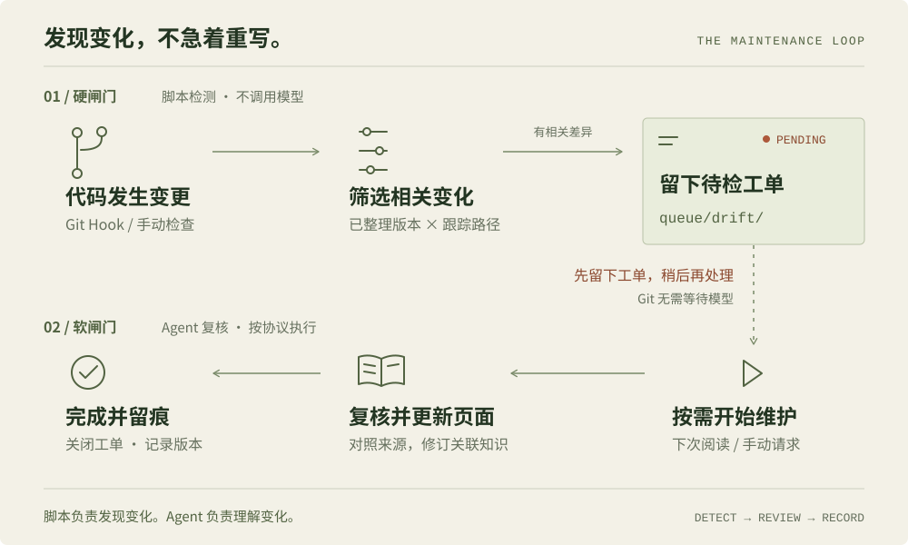

<!-- markdownlint-disable MD033 MD041 -->

<p align="center">
  
</p>

<p align="center">
  <strong>让知识留下来，而不只是让答案出现。</strong><br>
  本地 Markdown · GitHub 同步 · Obsidian 阅读 · 双层防腐化
</p>

<p align="center">
  <a href="#开始使用">开始使用</a> &nbsp; / &nbsp;
  <a href="#双层闸门">双层闸门</a> &nbsp; / &nbsp;
  <a href="#日常工作流">日常工作流</a> &nbsp; / &nbsp;
  <a href="#english">English</a>
</p>

## 从一份资料，到一张知识网络

你收集文章、论文和代码。Agent 把它们整理成**有来源、有交叉引用、可以持续更新**的 wiki，而不是只留下一段聊天记录。

基于 [Karpathy 的 LLM Wiki 模式](https://gist.github.com/karpathy/442a6bf555914893e9891c11519de94f)，本项目提供一套 [Agent Skill](https://agentskills.io)：协议、脚本与模板。你负责挑选资料和提出问题，Agent 负责摘要、关联与维护。

| 留下知识 | 保持可追溯 | 发现变化 |
| :--- | :--- | :--- |
| 把有价值的综合结果写成页面，下次继续积累。 | 原文与整理后的页面分层，代码仓记录引用版本。 | 跟踪代码变化，生成待检工单，交给 Agent 复核。 |

**装的是维护工具，拥有的是你自己的知识库。** Skill 可以公开分享；你的 wiki 独立存放，可以同步到私有 GitHub 仓库。

## 开始使用

### 01 / 安装 Skill

下面使用 Pi 支持的共享技能目录。已有同名目录时，请先检查内容，不要覆盖。

```bash
git clone https://github.com/feeeeling/llm-wiki-skill.git \
  "$HOME/.agents/skills/llm-wiki"
```

重新加载 Agent 后即可使用。其他 Agent Skills 宿主请按各自的技能目录安装；不想全局加载，可以选择项目级目录。

### 02 / 创建你的知识库

需要 Bash、Git 和已配置的 Git 提交身份。脚本会初始化本地仓库并创建首个提交。

```bash
bash "$HOME/.agents/skills/llm-wiki/scripts/init-wiki.sh" "$HOME/my-wiki"
cd "$HOME/my-wiki"
```

在 Agent 中打开这个目录，试着说：

> 阅读这篇文章，加入知识库。保留原文，整理主要观点，并关联已有页面。

用 Obsidian 的 **Open folder as vault** 打开同一个 `my-wiki` 目录，即可阅读页面、查看双链和知识图谱。无需另建网站。

### 03 / 同步到 GitHub

先在 GitHub 创建一个**空仓库**，按需设为私有，再执行：

```bash
cd "$HOME/my-wiki"
# 将 YOUR_ACCOUNT / YOUR_WIKI 替换为你自己的仓库
git remote add origin https://github.com/YOUR_ACCOUNT/YOUR_WIKI.git
git push -u origin main
```

另一台设备 clone 此仓库，再用 Obsidian 打开即可。写入前拉取，完成一批工作后提交并推送；这是一套 **Git 工作流，不是后台自动同步服务**。

## 双层闸门

**源文件变了，不代表结论一定错了；但它值得被重新检查。**

这套机制是对 Karpathy 模式的扩展：把“发现变化”和“理解变化”分开。脚本负责开单，Agent 负责判断哪些知识需要更新。

<p align="center">
  
</p>

| 层次 | 负责什么 | 不负责什么 |
| :--- | :--- | :--- |
| **硬闸门 · 脚本** | 根据 Git diff 与 `track` 范围生成工单。 | 不判断事实真假，不调用模型。 |
| **软闸门 · Agent** | 按 `AGENTS.md` 协议处理工单，复核并更新页面。 | 不是运行时强制拦截器，仍依赖 Agent 遵守协议。 |

`--report` **只列出已有工单**，不会重新扫描代码。Git 操作不会等待 LLM；工单也不会自动提交或推送。

<details>
<summary><strong>接入代码仓：登记来源 → 首次整理 → 安装 Hook</strong></summary>

从知识库内的示例创建来源登记：

```bash
cp "$HOME/my-wiki/sources/example.yaml.disabled" \
  "$HOME/my-wiki/sources/my-repo.yaml"
```

编辑 `git`、`local_paths`、`track` 和关联的 `pages`。完成第一次代码整理后，将 `compiled_rev` 设为实际核对过的提交 SHA；未设置时，检测脚本会跳过该来源。

然后安装本地 Hook：

```bash
bash "$HOME/my-wiki/scripts/install-hooks.sh" /path/to/code-repo \
  --wiki "$HOME/my-wiki"
```

目标事件为 merge、rebase 和分支 checkout。Hook 不随 clone 传播，每台设备需要单独安装。已有 Hook 或 `core.hooksPath` 配置时，先检查安装脚本及现有配置。

手动检测或查看队列：

```bash
# 检测一个代码仓，按跟踪范围生成工单
bash "$HOME/my-wiki/scripts/check-drift.sh" \
  --wiki "$HOME/my-wiki" --repo /path/to/code-repo

# 只查看已有的未完成工单
bash "$HOME/my-wiki/scripts/check-drift.sh" \
  --wiki "$HOME/my-wiki" --report
```

可选的 GitHub Actions 配置位于 [templates/github/](templates/github/)。它们是需要配置的示例，初始化不会自动启用。

更多说明：[Hook 接入](references/hooks.md) · [来源模板](templates/source.yaml)

</details>

## 日常工作流

| 你想做什么 | 对 Agent 说 |
| :--- | :--- |
| **收录** | “把这篇文章加入知识库，关联已有概念。” |
| **提问** | “我们对这个问题已经知道什么？给出来源。” |
| **维护** | “处理未完成的 drift 工单，更新相关页面。” |
| **巡检** | “检查孤儿页、失效链接、矛盾和过时结论。” |

`/wiki-lint` 是协议中的触发词，不是此仓库自动注册的通用斜杠命令；也可以直接使用自然语言。完整流程见 [SKILL.md](SKILL.md) 与 [维护协议](references/protocol.md)。

<details>
<summary><strong>知识库里有什么？</strong></summary>

```text
my-wiki/
├── AGENTS.md          维护约定与软闸门
├── raw/               原始资料与附件
├── wiki/              摘要、概念、实体与综合页面
├── sources/           代码仓指针与已整理版本
├── queue/drift/       可随 Git 同步的待检工单
├── scripts/           本地检测与 Hook 安装工具
└── .obsidian/         阅读与图谱配置
```

代码留在原仓库，知识库只登记指针。私有仓库不等于本地推理：使用云端模型时，读入的内容仍可能发送给模型服务商。

</details>

## English

**A local-first knowledge base maintained by your coding agent.** Compile sources into linked Markdown pages, browse them in Obsidian, and version them with Git.

The extra ingredient is a **dual gate**: a mechanical Git check creates drift tickets; the agent reviews affected knowledge on the next read or an explicit maintenance request. The soft gate is a protocol, not an enforced query blocker. `--report` lists existing tickets only.

Install with the HTTPS clone command above, then initialize your own wiki. Pi supports the shared `.agents/skills` directory; other hosts may require different installation paths. Bash and Git are required; the current scripts also use Python 3 as a fallback when `realpath` is unavailable, and in the optional cloud dispatch example.

---

Inspired by [Karpathy · LLM Wiki](https://gist.github.com/karpathy/442a6bf555914893e9891c11519de94f). Built for the [Agent Skills](https://agentskills.io) ecosystem. Released under [MIT](LICENSE).
